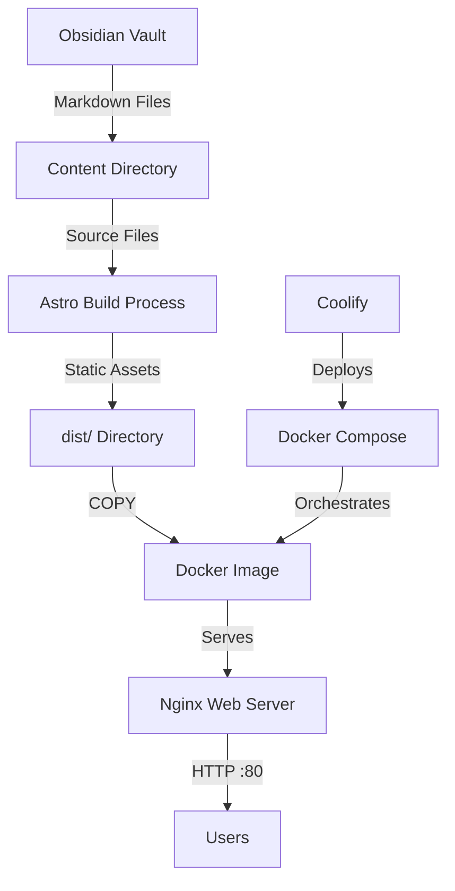

# Design Document

## Overview

The Obsidian-Astro Blog is a static site generation system that leverages Obsidian's markdown editing capabilities with Astro's modern static site generation. The system follows a simple workflow: content is created in Obsidian as markdown files, Astro builds these into a static website, and Docker packages everything for deployment via Coolify.

The architecture prioritizes simplicity and developer experience, using standard tools and minimal configuration to achieve a production-ready blog system.

## Architecture



### Key Design Decisions

1. **Content Storage**: Blog posts live in a `content/blog/` directory that serves as both the Obsidian vault location and Astro's content source
2. **Static Generation**: Astro builds at Docker image creation time, not runtime, for optimal performance
3. **Web Server**: Nginx serves the static files for production reliability and performance
4. **Deployment**: Multi-stage Docker build keeps the final image small and secure

## Components and Interfaces

### 1. Content Directory Structure

```
content/
└── blog/
    ├── post-1.md
    ├── post-2.md
    └── assets/
        └── images/
```

Each markdown file includes frontmatter:

```yaml
---
title: "Post Title"
date: 2025-10-26
description: "Brief description"
tags: ["tag1", "tag2"]
---
```

### 2. Astro Configuration

**File**: `astro.config.mjs`

- Configures content collections for the blog
- Sets up markdown processing with syntax highlighting
- Defines build output directory
- Configures image optimization

**Key Settings**:
- Output: `static` (for static site generation)
- Content directory: `./content`
- Build directory: `./dist`

### 3. Astro Pages

**Index Page** (`src/pages/index.astro`):
- Fetches all blog posts using Astro's content collections API
- Sorts posts by date (newest first)
- Displays post cards with title, date, description, and tags
- Provides links to individual posts

**Blog Post Page** (`src/pages/blog/[...slug].astro`):
- Dynamic route for individual posts
- Renders markdown content with proper styling
- Displays metadata (title, date, tags)
- Includes navigation back to home

**Layout Component** (`src/layouts/Layout.astro`):
- Provides consistent HTML structure
- Includes meta tags for SEO
- Responsive viewport configuration
- Global styles

### 4. Docker Configuration

**Multi-stage Dockerfile**:

```dockerfile
# Stage 1: Build
FROM node:20-alpine AS builder
WORKDIR /app
COPY package*.json ./
RUN npm ci
COPY . .
RUN npm run build

# Stage 2: Production
FROM nginx:alpine
COPY --from=builder /app/dist /usr/share/nginx/html
EXPOSE 80
CMD ["nginx", "-g", "daemon off;"]
```

**Design Rationale**:
- Multi-stage build reduces final image size
- Node 20 LTS for build stability
- Alpine Linux for minimal footprint
- Nginx for production-grade serving

### 5. Docker Compose Configuration

**File**: `docker-compose.yml`

```yaml
version: '3.8'
services:
  blog:
    build: .
    ports:
      - "3000:80"
    restart: unless-stopped
```

**Features**:
- Port mapping (host:container)
- Automatic restart policy
- Simple single-service configuration

### 6. Coolify Integration

**Requirements**:
- Git repository with Dockerfile and docker-compose.yml
- Coolify detects Docker Compose automatically
- Environment variables configurable through Coolify UI

**Deployment Flow**:
1. Push code to Git repository
2. Connect repository to Coolify
3. Coolify builds Docker image
4. Coolify deploys using Docker Compose
5. Automatic updates on Git push

## Data Models

### Blog Post Frontmatter Schema

```typescript
interface BlogPost {
  title: string;           // Required: Post title
  date: Date;              // Required: Publication date
  description: string;     // Required: Brief summary
  tags: string[];          // Optional: Category tags
  draft?: boolean;         // Optional: Hide from production
}
```

### Content Collection Configuration

Astro's content collections provide type-safe access to blog posts:

```typescript
// src/content/config.ts
import { defineCollection, z } from 'astro:content';

const blog = defineCollection({
  schema: z.object({
    title: z.string(),
    date: z.date(),
    description: z.string(),
    tags: z.array(z.string()).optional(),
    draft: z.boolean().optional(),
  }),
});

export const collections = { blog };
```

## Styling Strategy

### CSS Approach

Use minimal, semantic CSS with CSS custom properties for theming:

```css
:root {
  --color-text: #333;
  --color-background: #fff;
  --color-primary: #0066cc;
  --font-body: system-ui, sans-serif;
  --font-mono: 'Courier New', monospace;
  --spacing-unit: 1rem;
}
```

### Responsive Design

- Mobile-first approach
- Breakpoints: 640px (tablet), 1024px (desktop)
- Fluid typography using clamp()
- Flexible grid layouts

### Code Syntax Highlighting

Use Astro's built-in Shiki integration for code blocks with a clean theme.

## Error Handling

### Build-Time Errors

1. **Invalid Frontmatter**: Astro's Zod schema validation catches missing or incorrect frontmatter fields
2. **Missing Content**: Build fails if referenced files don't exist
3. **Markdown Syntax**: Astro reports parsing errors with file and line numbers

### Runtime Errors

1. **404 Handling**: Nginx serves custom 404 page if configured
2. **Container Failures**: Docker Compose restart policy handles crashes
3. **Port Conflicts**: Docker Compose reports port binding errors clearly

### Development Workflow

- Use `npm run dev` for local development with hot reload
- Use `npm run build` to test production builds locally
- Use `docker-compose up --build` to test containerized deployment

## Testing Strategy

### Manual Testing Checklist

1. **Content Creation**:
   - Create new markdown file in content/blog/
   - Verify frontmatter is recognized
   - Check post appears in index

2. **Build Process**:
   - Run `npm run build` successfully
   - Verify dist/ directory contains HTML files
   - Check asset optimization

3. **Docker Build**:
   - Build Docker image successfully
   - Run container and access on localhost
   - Verify all pages load correctly

4. **Responsive Design**:
   - Test on mobile viewport (375px)
   - Test on tablet viewport (768px)
   - Test on desktop viewport (1920px)

### Deployment Verification

1. Push to Git repository
2. Deploy via Coolify
3. Verify site is accessible at production URL
4. Test all navigation and links
5. Verify images load correctly

## Performance Considerations

1. **Static Generation**: All pages pre-rendered at build time for instant loading
2. **Image Optimization**: Astro optimizes images during build
3. **Minimal JavaScript**: Only essential JS shipped to browser
4. **Nginx Caching**: Configure cache headers for static assets
5. **Small Docker Image**: Alpine-based images reduce deployment time

## Security Considerations

1. **No Runtime Dependencies**: Static files only, no server-side code execution
2. **Nginx Hardening**: Use official Nginx Alpine image with security updates
3. **No Sensitive Data**: All content is public by design
4. **HTTPS**: Configure through Coolify's reverse proxy
5. **Content Sanitization**: Markdown rendering escapes HTML by default

## Future Enhancements

Potential features not in initial scope:

- RSS feed generation
- Search functionality
- Tag filtering pages
- Dark mode toggle
- Comments system integration
- Analytics integration
- Sitemap generation
- Social media meta tags
